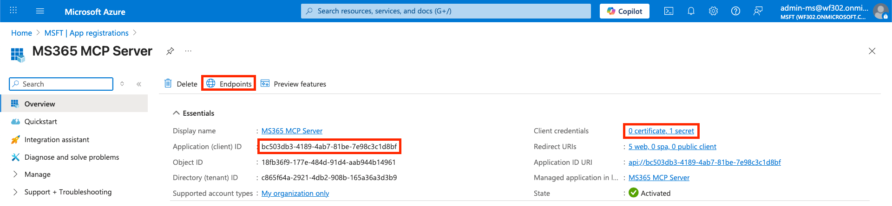

# IBM watsonx Orchestrate Agent using OAuth2 Authorization Code Flow

Working example of a custom Python tool for IBM watsonx Orchestrate that allows to query Calendar Events from Microsoft 365 using a member connection implementing an OAuth Authorization Code flow.

## Prerequisites

- [Microsoft 365 Developer Program](https://learn.microsoft.com/en-us/office/developer-program/microsoft-365-developer-program) account with E5 developer subscription.
- Microsoft Entra ID app registered on [Azure Portal](https://portal.azure.com/#home).

## Getting Started

To get started with the OAuth2 authorization code flow, you need to export the following environment variables:

```sh
export CLIENT_ID="CHANGEME"
export CLIENT_SECRET="CHANGEME"
export TENANT_ID="CHANGEME"
```

**Note**: Replace "CHANGEME" with your actual client ID, client secret, and tenant ID.



## Configuring the Connection

Next, you need to configure the connection to Microsoft 365. You can do this by running the following commands:

```sh
orchestrate connections add -a ms365
orchestrate connections configure -a ms365 --env draft -t member -k oauth_auth_code_flow
orchestrate connections set-credentials -a ms365 --env draft --client-id ${CLIENT_ID} --client-secret ${CLIENT_SECRET} --token-url "https://login.microsoftonline.com/${TENANT_ID}/oauth2/v2.0/token" --auth-url "https://login.microsoftonline.com/${TENANT_ID}/oauth2/v2.0/authorize" --grant-type authorization_code --scope "https://graph.microsoft.com/user.read https://graph.microsoft.com/calendars.read https://graph.microsoft.com/MailboxFolder.Read https://graph.microsoft.com/Mail.Read"
```

Repeat the same steps for the `live` environment:

```sh
orchestrate connections configure -a ms365 --env live -t member -k oauth_auth_code_flow
orchestrate connections set-credentials -a ms365 --env live --client-id ${CLIENT_ID} --client-secret ${CLIENT_SECRET} --token-url "https://login.microsoftonline.com/${TENANT_ID}/oauth2/v2.0/token" --auth-url "https://login.microsoftonline.com/${TENANT_ID}/oauth2/v2.0/authorize" --grant-type authorization_code --scope "https://graph.microsoft.com/user.read https://graph.microsoft.com/calendars.read https://graph.microsoft.com/MailboxFolder.Read https://graph.microsoft.com/Mail.Read"
```

## Importing Tools and Agents

You also need to import the necessary tools and agents:

```sh
orchestrate tools import --app-id ms365 -k python --file ./tools/ms365_email_search.py
orchestrate tools import --app-id ms365 -k python --file ./tools/ms365_list_calendar_events.py
orchestrate tools import -k python --file ./tools/ms365_get_date.py
orchestrate agents import -f agents/ms365_agent.yaml
```

## Cleanup

To clean up, you can remove the connections, tools, and agents:

```sh
orchestrate agents remove -k native -n MicrosoftAgent
orchestrate tools remove -n ms365_get_date
orchestrate tools remove -n ms365_list_calendar_events
orchestrate tools remove -n ms365_email_search
orchestrate connections remove -a ms365
```

## References

- [watsonx Orchestrate ADK](https://developer.watson-orchestrate.ibm.com/)
- [Get access on behalf of a user](https://learn.microsoft.com/en-us/graph/auth-v2-user?tabs=http)
- [Microsoft identity platform and OAuth 2.0 authorization code flow](https://learn.microsoft.com/en-us/entra/identity-platform/v2-oauth2-auth-code-flow)
